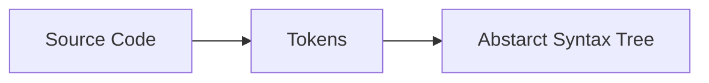

The first transformation from source code to tokens, is called "lexical analysis", or "lexing."
This is done by: a lexer (or aka tokenizer / scanner). The outputs are small, easily categorizable data structres which are fed into the _parser_, which does the second transformation and turns the tokens into an "Abstract Syntax Tree".

We wont be bothering with adding line numbers to the tokens (which allows one to add useful error messages which points to the offending token.)

For the first chapter, we just want to implement the lexer - just something that reads the input, attaches whatever data it needs to it, then call `NextToken()` to move onto the next one. No buffering or remembering.